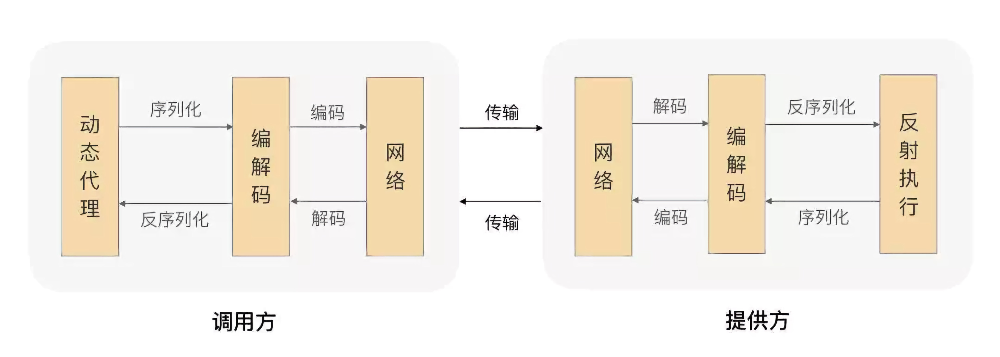

# ZRPC(远程过程调用)框架文档
    Ver: 1.0 | Updated: 2022.08.31 | @Zak
### 介绍
ZRPC：一个基于Spring的轻量RPC(Remote Procedure Call)框架，解决多服务之间的远程函数调用。
##### ✅ 配置简单，最小场景下只需要配置两处注解和一个配置文件。
##### ✅ 对业务代码无侵入，不需要改动任何业务逻辑代码。
##### ✅ 轻量级，无过多依赖，不依赖外部其他组件。
##### ✅ 支持配置/调用多个不同服务的提供方。
##### ✅ 支持既是 调用方 同时也是 提供方的业务场景。
##### ✅ 可解决调用方/提供方不同位置模型的序列化问题（序列化映射）。
##### ✅ 可自定义返回异常类型，在提供方返回业务异常时调用方也会抛出指定的异常类型。
##### ✅ 可自定义socket、连接池配置，满足不同业务场景下的性能调优。
##### ❌ 负载均衡、流量控制等能力目前需要依靠外部组件，在k8s环境下可直接利用k8s service等能力来实现。


### 基础使用

1. 在Maven Java项目pom.xml中(调用方&提供方都需要添加此依赖)
    ```xml
    <dependency>
      <groupId>cn.pingbase.zrpc</groupId>
      <artifactId>zrpc-core</artifactId>
      <version>1.0-SNAPSHOT</version>
    </dependency>
    ```
2. 配置(仅需要在调用方配置，提供方不需要加配置)
    ```yaml
    # 1)简单配置
    zrpc:
        remotes:
        - serverName: ServerA   # 必填! 这个名字下面调用方注解需要用
          schema: http          # http/https
          endpoint: 127.0.0.1   # 必填! 目标提供方地址(在k8s环境中可以配置service name)
          port: 8080            # 必填! 必须和目标提供方的server.port值一致
    
    # 2)多个远程提供方
    zrpc:
        remotes:
        - serverName: ServerA
          schema: http
          endpoint: 127.0.0.1
          port: 8080
        - serverName: ServerB
          schema: http
          endpoint: 127.0.0.1
          port: 9090
    ```
3. 在调用方和提供方的启动类上注解(`@ZRPCPackageScan`非必须，但建议配置上，因为这有助于加快扫描速度以及注册的准确度。)
   ```java
   @SpringBootApplication                              // 必须
   @ComponentScan(basePackages = {"cn.pingbase.zrpc"}) // 必须
   @ZRPCPackageScan(basePackages = {"com.xxx.yyy"})    // 可选，不填则扫描所有
   public class TestServer {
     public static void main(String[] args) {
       SpringApplication.run(TestServer.class, args);
     }
   }
   ```
4. 在调用方的接口类（interface）上注解:
    ```java
    // 注解中的serverName值必须和配置中的serverName值一致
    // 注解中的serviceIdentifier值必须和提供方@ZRPCRemoteService注解的serviceIdentifier值一致
    @ZRPCRemoteClient(serverName = "ServerA", serviceIdentifier = "TestService")
    ```
5. 在提供方的接口类/实现类（interface/class）上注解:
   ```java
   // 注解中的serviceIdentifier值必须和调用方@ZRPCRemoteClient注解的serviceIdentifier值一致
   // serviceImplClass: 可选，用于包含多个实现类时指定当前接口具体的实现类
   @ZRPCRemoteService(serviceIdentifier = "TestService", serviceImplClass = xxxx.class)
   ```
6. 调用接口
    ```java
    @Autowired
    TestService testService; // (IDEA警告可忽略: "Could not autowire. No beans of 'TestService' type found.")
    
    testService.test();
    ```
---

### 高级使用

#### 1. 自定义序列化类型

当远程函数的返回值/参数值为自定义类型，RPC过程中的序列化会是一个问题
ZRPC为了解决这个问题进行了类型自动映射，使用者仅需要在调用方的interface中具体函数上注解`@ZRPCSerializeBinder`，例如:

```java
@ZRPCSerializeBinder(remoteClassName = "com.xxx.remote.model.TestModel", currentClass = TestModel.class)
@ZRPCSerializeBinder(remoteClassName = "com.xxx.remote.model.Body", currentClass = Body.class)
List<TestModel> getTestModel(Body body);
```
也可以使用另外一个注解`@ZRPCSerializeBinders`，例如:
```java
@ZRPCSerializeBinders({
    @ZRPCSerializeBinder(remoteClassName = "com.xxx.remote.model.TestModel", currentClass = TestModel.class),
    @ZRPCSerializeBinder(remoteClassName = "com.xxx.remote.model.Body", currentClass = Body.class)
})
TestModel getTestModel(Body body);
```

#### 2. 自定义业务异常

当远程函数的执行出现业务的异常(逻辑代码主动抛出的异常)，默认RPC调用方收到的异常类型为`ZRPCBusinessException`
某些场景RPC调用方需要根据特定的异常类型进行逻辑处理，使用者仅需要在调用方的interface中具体函数上注解`@ZRPCThrowableBinder`即可自定义业务异常类型(异常中的`message`字段已赋值为提供方抛异常时的值)
```java
@ZRPCThrowableBinder(exceptionClass = CustomException.class)
void check();
```
*注意: 自定义的`CustomException`必须继承Exception/RuntimeException/Throwable并实现单个String类型入参的构造函数!*

#### 3. RPC框架socket参数
ZRPC框架支持调整socket参数，当前默认参数及含义:
```yaml
# 连接超时时间(单位: 毫秒)
connectTimeoutInMs: 500

# 读超时时间(单位: 毫秒)
readTimeoutInMs: 500

# 写超时时间(单位: 毫秒)
writeTimeoutInMs: 500

# 最大闲置连接数
maxIdleConnections: 50

# 闲置连接数最长保活时间(单位: 分钟)
keepAliveDurationInMin: 5
```
完整配置示例:
```yaml
zrpc:
    remotes:
    - serverName: ServerA
      schema: http
      endpoint: 127.0.0.1
      port: 8080
    - serverName: ServerB
      schema: http
      endpoint: 127.0.0.1
      port: 9090
    socket:
          connectTimeoutInMs: 500
          readTimeoutInMs: 500
          writeTimeoutInMs: 500
          maxIdleConnections: 50
          keepAliveDurationInMin: 5
```

### TODO🚴‍♂️
- [ ] 提升资源隔离性（独立线程，独立连接），降低某些场景下对业务本身的影响。
- [ ] 支持配置多种序列化框架，给用户更多的选择空间。
- [ ] 兼容主流注册中心协议，如：Nacos、Consul、Etcd等。
- [ ] 支持多种模式：独立模式/分布式注册模式。
- [ ] 实现ZRPC注册中心，支持多负载均衡算法与动态流量控制。
- [ ] Metrics，可监控：总调用量，服务/接口成功率，延迟等指标。
- [ ] 核心调用稳定性、性能报告。
